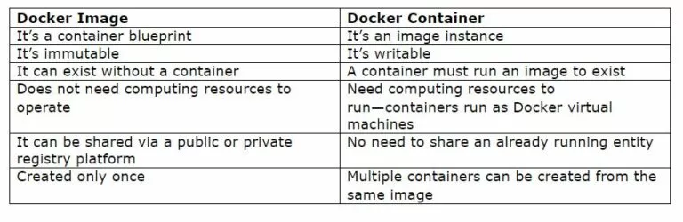

=
<h1 align="center">Wiki</h1>

---

- [Software](#software)
  - [Docker](#docker)
    - [Installing](#installing)
    - [Getting Started](#getting-started)
    - [FAQ](#faq)
- [Concepts](#concepts)
- [Error Handling](#error-handling)
- [FAQ](#faq-1)

# Software
## Docker
### Installing
Installing docker in ubuntu
```sh
# Dependencies
sudo apt install apt-transport-https ca-certificates curl software-properties-common

# Adding docker gpg keys
curl -fsSL https://download.docker.com/linux/ubuntu/gpg | sudo apt-key add -

# Adding repository to source list
. /etc/lsb-release && sudo add-apt-repository "deb [arch=amd64] https://download.docker.com/linux/ubuntu ${DISTRIB_CODENAME} stable"

sudo apt upgrade
```
```sh1
sudo apt install docker-ce
```
Installing done, now we need to start the docker service and  setup it for user, 
```sh
# Enabling docker as startup service
sudo systemctl enable docker

# Setting up docker for user
sudo usermod -aG docker ${USER}
```
After executing this do restart or user logout. OR execute `su - ${USER}` in terminal.

### Getting Started
   
**General commands**    
- `docker search ubuntu` - searching docker with name ubuntu      
- `docker pull ubuntu:16.04` - downloads ubuntu 16.04 docker image 
- `docker images` - shows list the docker images
- `docker ps` - List containers
- `docker ps -a` - Show all containers
  
**Follow the below command to create your first container**
  
| Command | Usage  | Example  | Syntax |
| :---   | :-: | :-: | :-: |
| docker pull | Pull an image or a repository from a registry | docker pull ubuntu:16.04 |docker pull \<image_name>:\<tag>|
| docker run | Run a command in a new container | docker run -it ubuntu:16.04 --name myubuntucontainer | docker run -it \<imagename>:\<tag> --name \<name_of_container_to_be_created> |
| docker start | Start one or more stopped containers | docker start -ai myubuntucontainer | docker start -a -i \<name-of-container> |
| docker commit | Create a new image from a container's changes | docker commit myubuntucontainer ubuntu-changed:16.04 | docker commit \<container_name> \<image_name>:\<tag> |

NOTE: `-it` can be written as `-i -t`
- -i - interactive(STDIN)
- -t - create pseudo tty
- -a - attach STDOUT      
Try running the command without giving these option, you will understand its function


<details>
<summary>
Other commands
</summary>

- `docker exec`   -   execute command in running container
- `docker rm`     -   to delete docker container
- `docker rmi`    -   to delele docker image
- `docker tag`    -   giving tag name for image
- `docker stop`   -   to stop the container
- `docker save`   -   to save the image as archive
- `docker load`   -   to load image from archive

</details>



Just gothrough this
https://www.whitesourcesoftware.com/free-developer-tools/blog/docker-images-vs-docker-containers/

### FAQ
**Q:** Why Docker?              
**A:** If you need to run application in specific version of OS or specific environment(libraries), the possible solutions are using virtual machine, dual booting, **but** it's time consuming and not portable. Now the era begins with docker, it's very lightwight and portable
<details>
<summary>
Pros
</summary>

- **Consistency :**  You always launch from the same starting point. Docker enables a coordinated environment for your application from development to production.**(if you changed something and didn't commited then changes will be lost )**
- **Speed :** You can rapidly start a new process on the server. Because the image is pre-configured and installed with the process you want to run, it removes all the complexity associated with starting a process.
- **Isolation :** Every launched Docker container is isolated from the file system, the network, and other running processes. As a result, applications can contain different versions of the same support software.
- **Scalability :** You can add several of the same containers to create multiple instances of the same application
</details>

**Q:** How Docker works?              
**A:** It runs docker image in a docker container, you can create multiple containers of same image. Images have it's own libraries,runtime,code.

**Q:** What is docker image?              
**A:** Docker image is a set of libraries,runtime,system tools,codes with all configuration set up. So that whenever we need just pull or load it and use.

**Q:** What is docker container?              
**A:** Docker container is isolated environment which is loaded with an docker image.


# Concepts

# Error Handling

# FAQ